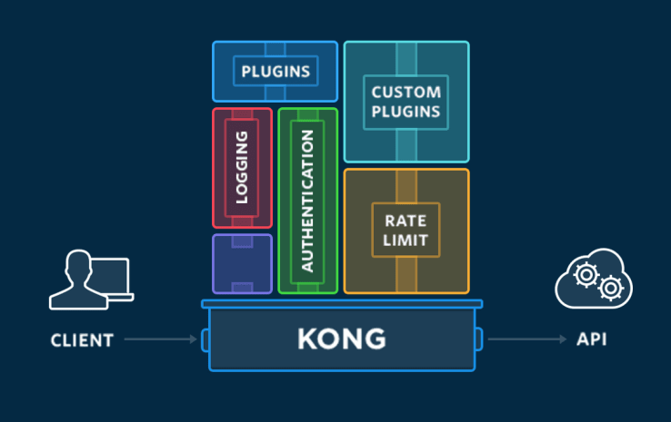

[![Contributors][contributors-shield]][contributors-url]
[![Forks][forks-shield]][forks-url]
[![Stargazers][stars-shield]][stars-url]
[![Issues][issues-shield]][issues-url]
[![MIT License][license-shield]][license-url]

<!-- PROJECT LOGO -->
<br />
<p align="center">
  
  <h2 align="center">delineate.io</h2>
  <p align="center">portray or describe (something) precisely.</p>

  <h3 align="center">Kong Example</h3>

  <p align="center">
    Multi-node Kong API Gateway deployment playground!
    <br />
    <a href="https://github.com/delineateio/kong-example"><strong>Explore the docs »</strong></a>
    <br />
    <br />
    <a href="https://github.com/delineateio/kong-example">View Demo</a>
    ·
    <a href="https://github.com/delineateio/kong-example/issues">Report Bug</a>
    ·
    <a href="https://github.com/delineateio/kong-example/issues">Request Feature</a>
  </p>
</p>

## Table of Contents

<!-- START doctoc generated TOC please keep comment here to allow auto update -->
<!-- DON'T EDIT THIS SECTION, INSTEAD RE-RUN doctoc TO UPDATE -->

- [About The Project](#about-the-project)
- [Built With](#built-with)
- [Getting Started](#getting-started)
  - [Local Dependencies](#local-dependencies)
  - [Local Setup](#local-setup)
- [Usage](#usage)
  - [Usual Lifecycle](#usual-lifecycle)
  - [Full Target List](#full-target-list)
- [Roadmap](#roadmap)
- [Contributing](#contributing)
- [License](#license)
- [Acknowledgements](#acknowledgements)

<!-- END doctoc generated TOC please keep comment here to allow auto update -->

<!-- ABOUT THE PROJECT -->
## About The Project



This repo provides an updated, scalable (in terms of nodes) and version pinned Docker Compose stack.

The motivation was that te official [Kong](https://docs.konghq.com/) repo located [here](https://github.com/Kong/docker-kong) template does not seem to be maintained.  An issue has been raised [here](https://github.com/Kong/docker-kong/issues/521)

## Built With

Further logos can be inserted to highlight the specific technologies used to create the solution from [here](https://github.com/Ileriayo/markdown-badges).


<!-- GETTING STARTED -->
## Getting Started

To get a local copy up and running follow these simple steps.

### Local Dependencies

A number of local dependencies are required.  To review the local dependencies:

* When using `MacOS` run `make requirements`
* Otherwise run `cat Brewfile` to inspect the requirements

If additional dependencies are required they should be added to `Brewfile`, for more details please review the official `brew bundle` documentation [here](https://github.com/Homebrew/homebrew-bundle).

### Local Setup

This repo follows the principle of minimal manual setup of the local development environment.

 A `make` target has been provided for simplicity ```make init```, the `make` file can be inspected for more details.

 ```shell
# use the folder name as the repo name
make init

# explicitly pass in the repo name (e.g. my-service)
make repo=my-service init
 ```

If at a later date repo name needs to be changed then the `make rename` target can be called.

```shell
make repo=my-service rename
```

<!-- USAGE EXAMPLES -->
## Usage

### Usual Lifecycle

The following commands represent a typical set of commands and lifecycle of the stack.

```shell
# creates the Kong stack
make up-db

# lists the stack containers (irrespective of status)
make ps

# tears down the Kong stack
make down
```

### Full Target List

| Target| Purpose |
| --- | ----------- |
| `make list` | Lists the `brew` and `pip` dependencies that will be installed. |
| `make init` | Full initialises the local development environment.|
| `make services` | Creates the backend services to enable the application to be run natively. |
| `make up-dbless` | Deploys a lightweight Kong API Gateway stack. |
| `make up-db` | Deploys a full Kong API Gateway stack including a `postgres` backend. |
| `make ps` | Lists the primary info and status of the docker containers. |
| `make down` | Teardown the Kong API Gateway stack. |
| `make rename` | Only required in exceptional cased to rename the repo and update `readme` badges. |

<!-- ROADMAP -->
## Roadmap

See the [open issues](https://github.com/delineateio/kong-example/issues) for a list of proposed features (and known issues).

<!-- CONTRIBUTING -->
## Contributing

Contributions are what make the open source community such an amazing place to be learn, inspire, and create. Any contributions you make are **greatly appreciated**.

1. Fork the Project
2. Create your Feature Branch (`git checkout -b feature/AmazingFeature`)
3. Commit your Changes (`git commit -m 'Add some AmazingFeature'`)
4. Push to the Branch (`git push origin feature/AmazingFeature`)
5. Open a Pull Request

If you would like to contribute to any Capco Digital OSS projects please read:

* [Code of Conduct](https://github.com/delineateio/.github/blob/master/CODE_OF_CONDUCT.md)
* [Contributing Guidelines](https://github.com/delineateio/.github/blob/master/CONTRIBUTING.md)

<!-- LICENSE -->
## License

Distributed under the MIT License. See `LICENSE` for more information.

<!-- ACKNOWLEDGEMENTS -->
## Acknowledgements

* [Best README Template](https://github.com/othneildrew/Best-README-Template)
* [Markdown Badges](https://github.com/Ileriayo/markdown-badges)
* [DocToc](https://github.com/thlorenz/doctoc)

<!-- MARKDOWN LINKS & IMAGES -->
<!-- https://www.markdownguide.org/basic-syntax/#reference-style-links -->
[contributors-shield]: https://img.shields.io/github/contributors/delineateio/kong-example.svg?style=for-the-badge
[contributors-url]: https://github.com/delineateio/kong-example/graphs/contributors
[forks-shield]: https://img.shields.io/github/forks/delineateio/kong-example.svg?style=for-the-badge
[forks-url]: https://github.com/delineateio/kong-example/network/members
[stars-shield]: https://img.shields.io/github/stars/delineateio/kong-example.svg?style=for-the-badge
[stars-url]: https://github.com/delineateio/kong-example/stargazers
[issues-shield]: https://img.shields.io/github/issues/delineateio/kong-example.svg?style=for-the-badge
[issues-url]: https://github.com/delineateio/kong-example/issues
[license-shield]: https://img.shields.io/github/license/delineateio/kong-example.svg?style=for-the-badge
[license-url]: https://github.com/delineateio/kong-example/blob/master/LICENSE
